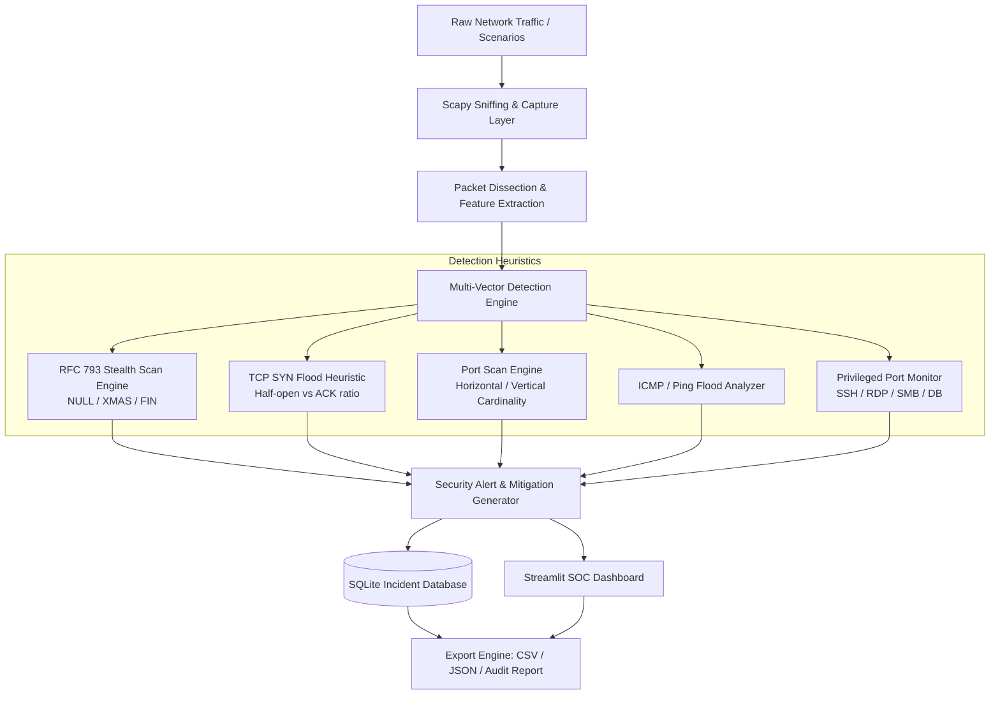

# Network Intrusion Detection & Telemetry Monitoring System (NIDS)
**Academic Project Report & Evaluation Outline**  
*Department of Computer Science & Engineering — Computer Networks & Cyber Defense*

---

## 1. Project Title & Abstract
**Title:** Real-Time Rule-Based Network Intrusion Detection and Deep Packet Inspection System  
**Abstract:**  
As modern corporate and academic networks face increasingly sophisticated cyber threats, lightweight, transparent, and explainable network defense mechanisms are essential. This project develops an end-to-end, rule-based Network Intrusion Detection System (NIDS) utilizing Python, Scapy, SQLite, and Streamlit. The system captures live Layer-3 and Layer-4 network traffic, dissects packet headers, and executes multi-vector threat detection algorithms. These algorithms identify reconnaissance activities (horizontal/vertical port scans, RFC 793 stealth scans such as NULL, FIN, and XMAS scans), volumetric Denial of Service attacks (TCP SYN floods, ICMP ping floods, UDP anomalies), and sensitive administrative service probing. Alerts are stored persistently in SQLite, mapped to MITRE ATT&CK techniques, paired with actionable firewall mitigation rules, and visualized through an interactive Security Operations Center (SOC) dashboard.

---

## 2. Project Objectives
1. **Packet Dissection & Telemetry:** Capture and inspect raw Ethernet frames and IP packets in real time without interfering with network throughput.
2. **RFC 793 State Machine Anomaly Detection:** Implement strict protocol compliance checks to detect evasive stealth port scans (NULL, FIN, XMAS) that exploit TCP flag inconsistencies.
3. **Volumetric & DoS Attack Mitigation:** Detect half-open connection floods (SYN floods) and ICMP bandwidth saturation attacks, providing automated `iptables` remediation rules.
4. **Interactive Security Operations Center (SOC):** Deliver visual analytics including protocol distributions, threat severity breakdowns, top talkers, and deep packet inspection tables.
5. **Audit Logging & Report Export:** Enable persistent incident logging in SQLite and one-click export of structured security incident audit reports (CSV, JSON, Markdown).

---

## 3. Technology Stack & Tools
- **Core Language:** Python 3.10+
- **Packet Dissection:** Scapy (interfacing with Npcap/WinPcap kernel drivers)
- **Data Engineering & Analytics:** Pandas, Altair, NumPy
- **Database Engine:** SQLite 3 (ACID-compliant local persistence with automated schema migration)
- **Visualization & UI:** Streamlit (reactive web-based SOC dashboard)

---

## 4. System Architecture


---

## 5. Detection Engine Formulations & Rules

### 5.1 RFC 793 Stealth Scan Detection
Stateless firewalls often inspect only the `SYN` bit to establish inbound state. Attackers craft non-standard flag combinations to elicit response codes from closed ports without leaving logs in application audit files:
- **NULL Scan:** TCP packet where `flags == 0` (no flags set).
- **XMAS Scan:** TCP packet where `flags == FIN | PSH | URG`.
- **FIN Scan:** TCP packet where `flags == FIN` without preceding handshake.
**Rule:** Any packet matching these specific flag masks triggers an immediate `CRITICAL` alert with corresponding drop rules:
```bash
iptables -A INPUT -p tcp --tcp-flags ALL FIN,PSH,URG -j DROP
```

### 5.2 TCP SYN Flood (Denial of Service)
In a healthy TCP connection, the client completes the 3-way handshake (`SYN` $\rightarrow$ `SYN-ACK` $\rightarrow$ `ACK`). In a SYN flood:
$$\text{SYN\_Count}(src, dst) \ge \theta_{\text{syn}} \quad \text{and} \quad \text{SYN\_Count} > 3 \times \text{ACK\_Count}$$
When triggered, the system alerts on kernel backlog exhaustion and suggests:
```bash
sysctl -w net.ipv4.tcp_syncookies=1
```

### 5.3 Port Scanning (Reconnaissance)
Tracks destination port cardinality per source-destination pair:
$$| \{ \text{dst\_port} \in \text{Traffic}(src, dst) \} | \ge \theta_{\text{scan}}$$

### 5.4 Volumetric ICMP Flood
$$\text{ICMP\_Echo\_Count}(src, dst) \ge \theta_{\text{icmp}}$$

---

## 6. Experimental Simulation & Validation Scenarios
The system provides built-in multi-scenario test suites for live classroom demonstration:
1. **Scenario 1: Comprehensive Multi-Attack Traffic** (Baseline traffic mixed with Port Scans, SYN Floods, Stealth Scans, and ICMP Floods).
2. **Scenario 2: DoS TCP SYN Flood** (Validates backlog queue saturation detection).
3. **Scenario 3: Stealth Scans** (Validates RFC 793 flag bit dissection).
4. **Scenario 4: Horizontal & Vertical Port Scan** (Validates cardinality tracking).
5. **Scenario 5: ICMP Ping Flood** (Validates layer-3 volumetric rate monitoring).
6. **Scenario 6: Clean Benign Baseline** (Validates that legitimate web, DNS, and database traffic produce **0 false positive alerts**).

---

## 7. Viva Defense & Examination Guide
- **IDS vs. IPS:** IDS passively analyzes mirrored traffic (out-of-band); IPS actively filters packets (in-line).
- **Signature vs. Anomaly IDS:** Signature matches specific patterns (low false positives); Anomaly detects deviations from baselines (can detect zero-days).
- **Why TCP SYN Cookies?** Encodes state into Initial Sequence Numbers (ISNs) to eliminate embryonic connection buffer allocation.
- **Scapy Packet Sniffing:** Bypasses standard OS sockets by utilizing Npcap / WinPcap packet drivers to capture raw frames directly from the NIC.

